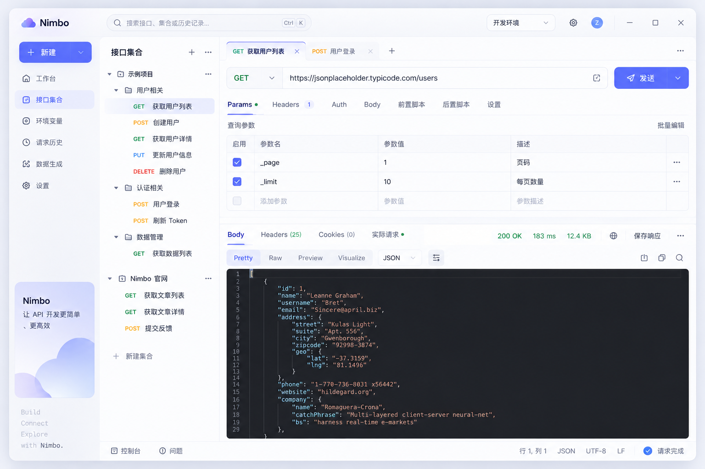

# Nimbo

[简体中文](README.zh-CN.md) · English

Nimbo is a fast, native, local-first API client built for HarmonyOS. It gives developers a focused workspace for composing HTTP requests, inspecting responses, organizing collections, and switching environments—without requiring an account or cloud service.



## Highlights

- Native HarmonyOS application distributed for PC (`2in1`); responsive tablet and phone layouts remain in the codebase for future use
- HTTP requests with GET, POST, PUT, PATCH, DELETE, HEAD, and OPTIONS
- Query parameters, headers, Bearer/Basic/API Key authentication, and multiple body types
- Pretty and raw response views, response headers, cookies, error states, and binary saving
- Nested collections and folders with persistent saved requests
- Syntax-highlighted JSON request editing and selectable read-only JSON responses
- Persistent built-in environments, imported environments, and variable resolution
- Global search across requests, collections, history, environments, and commands
- Local request history and workspace restoration
- A unified title-bar importer with highlighted cURL editing and drag-and-drop API files, with automatic Postman Collection/Environment and OpenAPI 3.x / Swagger 2.0 JSON detection
- Response JSONPath preview and explicit environment-variable extraction with overwrite protection
- Local Nimbo backup export with secrets redacted by default
- Light, dark, and system themes
- English and Simplified Chinese interfaces

## Project status

Nimbo 1.0's core workflow is implemented and can run on a HarmonyOS PC target:

```text
Create or import a request
        ↓
Configure and send it
        ↓
Inspect the response
        ↓
Save it into a collection
        ↓
Reuse it with environments and history
```

WebSocket, SSE, GraphQL, gRPC, collection runners, scripts, AI features, cloud sync, and accounts are not implemented yet. The interface intentionally does not expose unavailable features.

## Requirements

- macOS
- DevEco Studio with the HarmonyOS SDK installed
- Compile/target SDK: HarmonyOS 6.1.1 (API 24)
- Compatible SDK: HarmonyOS 6.0.0 (API 20)
- A HarmonyOS device or emulator

## Getting started

Clone the repository:

```shell
git clone git@github.com:burybell/nimbo.git
cd nimbo
```

Create your local build profile:

```shell
cp build-profile.example.json5 build-profile.json5
```

Open the project in DevEco Studio, configure a signing profile for your own application, and run the `entry` module.

You can also build from the command line when DevEco Studio is installed at its default macOS location:

```shell
./build_hap.sh
```

Run repository checks together with a local HarmonyOS build:

```shell
./scripts/quality-check.sh --build
```

The HAP output is written under:

```text
entry/build/default/outputs/default/
```

`build-profile.json5` is intentionally ignored because DevEco Studio may store machine-specific signing paths and credentials in it. Never commit your local signing profile, certificate, keystore, or passwords.

## Project structure

```text
AppScope/                         Application resources and identity
entry/src/main/ets/
├── app/                          Root application composition and state
├── controller/                   Request orchestration
├── models/                       UI and persistence models
├── network/                      HTTP engine
├── services/                     Import, export, and local storage
├── state/                        Defaults and initial state
└── ui/                           Components, pages, and design tokens
docs/nimbo-dev-package/           PRD, UI/UX specification, and handoff notes
```

The current delivery scope and engineering constraints are documented in [`CODEX_HANDOFF.md`](docs/nimbo-dev-package/CODEX_HANDOFF.md).

## Local-first privacy

Collections, requests, environments, history, preferences, and restored tabs stay on the local device. Nimbo does not require an account and does not provide cloud synchronization in the current version. Be careful when exporting backups that include secrets.

## Contributing

Issues and pull requests are welcome. Before making a large change, please open an issue to discuss its scope. Keep the project buildable, avoid exposing unfinished controls, and do not implement capabilities explicitly marked as deferred in the handoff document without prior discussion.

Read [`CONTRIBUTING.md`](CONTRIBUTING.md) before submitting a change. Contributions require acceptance of the [Nimbo Contributor License Agreement](CLA.md).

## License

Nimbo is licensed under the [GNU Affero General Public License v3.0 only](LICENSE). Commercial licensing may be offered separately by the copyright holder.

## Application identity

- Bundle name: `com.nimbo.app`
- Huawei App ID: `6917615930484878194`

The App ID identifies the official Nimbo application. Contributors should use their own application identity and signing profile for local development.
